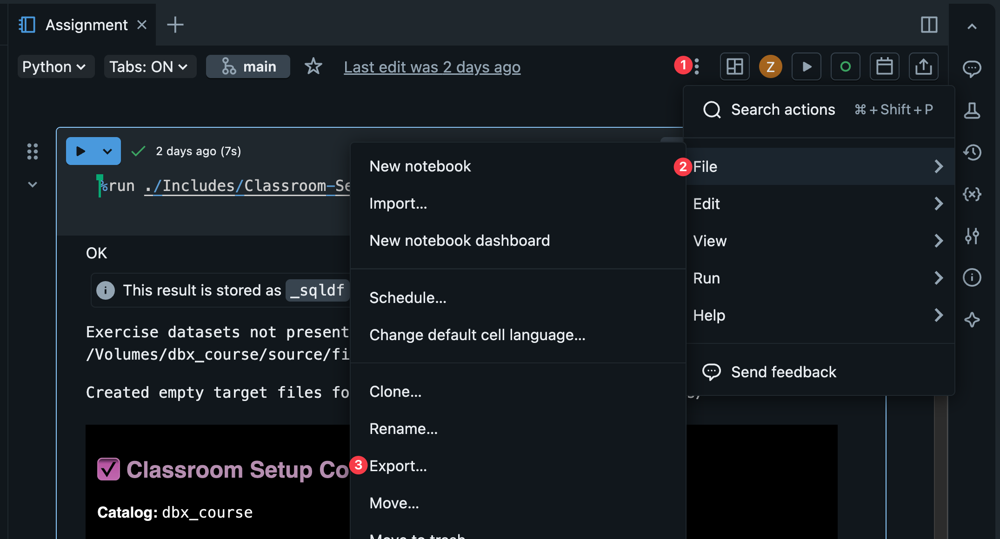
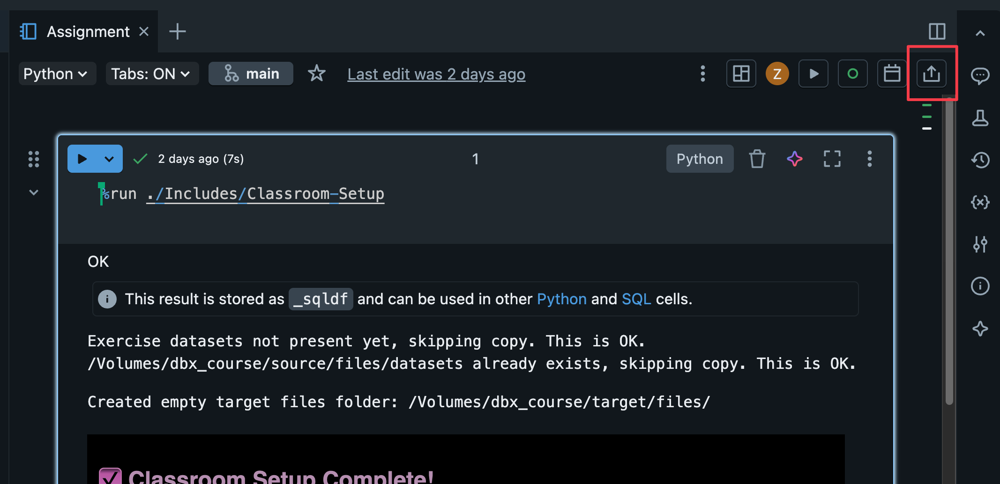

# Homework: Data Engineering 2 - Modern Data Platforms - Databricks

In this assignment, you will analyze a dataset using Spark on Databricks. You work in groups of two on a dataset you already selected. Your submission is a single Databricks notebook that reads like a **data analysis report** -- not just raw code.

- [The Task](#the-task)
- [Delivery](#delivery)
- [Exercise Datasets](#exercise-datasets)

## The Task

Analyze your selected dataset by completing the requirements below. Each section has a point value. The total is **100 points**.

For every code cell, add a **`%md` markdown cell above it** explaining what the command does and why. Use markdown headings to organize the notebook into logical sections. Keep explanations short but meaningful. Your notebook must have at least **20 code cells** (not counting markdown cells). `%sql` and `%fs` cells count as code cells; `%md` cells do not.

Some sections are marked as **self-learning**. These require you to look up techniques in the course reference notebooks or the PySpark documentation -- they were not practiced hands-on in class.

---

## Requirements

### 1. Data Ingestion & Exploration (15 points)

- **(3 pts)** Use `dbutils.fs.ls()` or `%fs ls` to list and explore the dataset files on the volume.
- **(4 pts)** Load the CSV dataset using `spark.read.csv()` with `header=True` and `inferSchema=True`. Display the DataFrame and print its schema using `.printSchema()`.
- **(4 pts)** Load the same CSV but with a **manually defined schema** using a DDL-formatted string. If the dataset has too many columns, defining the schema for the first 5 columns is sufficient (Spark will only load the columns you defined).
- **(4 pts)** Show the total number of rows using `.count()` and display a sample using `display()`.

### 2. SQL Queries (10 points)

- **(3 pts)** Use `df.createOrReplaceTempView()` to register the DataFrame as a temporary view. Then use `spark.table()` to read it back into a new DataFrame variable.
- **(7 pts)** Write at least **2 SQL queries** using `%sql` or `spark.sql()` that answer meaningful questions about the data. Each query must be different in nature (e.g., one with filtering, one with aggregation).

### 3. DataFrame Transformations (20 points)

- **(5 pts)** Apply `filter()` or `where()` with at least **2 different, meaningful filter conditions**.
- **(5 pts)** Use `select()` to pick relevant columns and `withColumn()` to create at least **1 new computed/derived column** (e.g., a calculation, a type cast, a conditional).
- **(5 pts)** Use `sort()` or `orderBy()` to sort your results meaningfully, combined with `limit()` to show the top or bottom records.
- **(5 pts)** Use `distinct()` or `dropDuplicates()` on your dataset. Add a markdown cell explaining whether duplicates exist and what they represent.

### 4. Aggregations (15 points)

- **(5 pts)** Use `groupBy()` with at least **2 different built-in aggregation methods** (e.g., `.avg()` and `.count()`, or `.sum()` and `.max()`). These should be separate expressions (e.g., `df.groupBy("x").count()` and `df.groupBy("x").avg("y")`).
- **(10 pts)** Use the `groupBy().agg()` function with at least **3 named aggregate functions** from `pyspark.sql.functions` (e.g., `avg()`, `sum()`, combined with a self-learned function such as `stddev()`, `collect_list()`, or `countDistinct()`). At least one of these must be a function that was **not directly demonstrated** in the class walkthrough. Functions demonstrated in class: `avg`, `sum`, `min`, `max`, `count`, `mean`, `approx_count_distinct`. Refer to the course notebook `ASP 3.1 - Aggregation` for how to import and use `pyspark.sql.functions`, and the <a href="https://spark.apache.org/docs/latest/api/python/reference/pyspark.sql/functions.html" target="_blank">pyspark.sql.functions documentation</a> for the full list of available functions. **This is a self-learning task.**

### 5. Visualizations (8 points)

- **(8 pts)** Create at least **2 visualizations** using Databricks' built-in charting capabilities (via `display()`). They must be **2 different chart types** (e.g., bar chart and line chart -- not two bar charts). After calling `display()`, use the **+** button or chart icon in the output toolbar to configure your chart type.

### 6. Delta Lake (10 points)

- **(3 pts)** Write a DataFrame to **Delta format** under `DA.paths.workdir` (the target volume set up by Classroom-Setup).
- **(3 pts)** Use `dbutils.fs.ls()` to list the Delta folder and confirm that the `_delta_log/` directory exists. Add a markdown cell explaining what the `_delta_log` is and why it matters.
- **(4 pts)** Use `.saveAsTable()` to register the Delta data as a **table in the catalog**, then query it using `%sql` or `spark.sql()`. Refer to the Delta Lake notebook (`Reference 2 - Delta Lake/ASP 6.1 - Delta Lake`) and the <a href="https://spark.apache.org/docs/latest/api/python/reference/pyspark.sql/api/pyspark.sql.DataFrame.html" target="_blank">DataFrame API documentation</a>.

### 7. Additional pyspark.sql.functions (5 points)

- **(5 pts)** Use at least **2 functions** from `pyspark.sql.functions` that you have **not already used elsewhere** in this notebook. Examples: `when()`/`otherwise()`, `round()`, `upper()`/`lower()`, date functions, string functions. Refer to course notebooks `ASP 3.1 - Aggregation` (for how to import functions), `ASP 3.2 - Datetimes`, `ASP 3.3 - Complex Types`, `ASP 3.4 - Additional Functions`, or the <a href="https://spark.apache.org/docs/latest/api/python/reference/pyspark.sql/functions.html" target="_blank">pyspark.sql.functions documentation</a>. **This is a self-learning task.**

### 8. Null Handling with DataFrameNaFunctions (5 points)

- **(5 pts)** Use `.na.drop()` or `.na.fill()` meaningfully on your dataset. Add a markdown cell explaining **why** you chose to drop or fill nulls, and what fill values you used (if applicable). Refer to `ASP 3.4 - Additional Functions` and the <a href="https://spark.apache.org/docs/latest/api/python/reference/pyspark.sql/api/pyspark.sql.DataFrame.html" target="_blank">DataFrame API documentation</a>. **This is a self-learning task.**

### 9. Notebook Presentation (5 points)

- **(5 pts)** Your notebook should read as a well-organized **data analysis report**. Use `%md` markdown headings to structure it into clear sections. Every code cell should have a markdown cell above it explaining what it does. The explanations can be short, but they must be present and meaningful.

### 10. Data Story (7 points)

- **(7 pts)** Write **2-3 paragraphs** in dedicated markdown cells interpreting at least 2 of your query or aggregation results. What patterns did you find? What surprised you? What would you investigate next? This is separate from the per-cell code explanations in Section 9 -- write standalone analytical paragraphs about your findings, not just descriptions of what each cell does.

---

## Points Summary

| # | Section | Points | ~Code Cells |
|---|---------|--------|-------------|
| 1 | Data Ingestion & Exploration | 15 | 4-6 |
| 2 | SQL Queries | 10 | 3-4 |
| 3 | DataFrame Transformations | 20 | 4-6 |
| 4 | Aggregations | 15 | 2-3 |
| 5 | Visualizations | 8 | 2 |
| 6 | Delta Lake | 10 | 3-4 |
| 7 | Additional pyspark.sql.functions | 5 | 1-2 |
| 8 | Null Handling (DataFrameNaFunctions) | 5 | 1 |
| 9 | Notebook Presentation | 5 | -- |
| 10 | Data Story | 7 | -- |
| | **Total** | **100** | **~20-27** |

---

## Reference Documentation

- <a href="https://spark.apache.org/docs/latest/api/python/reference/pyspark.sql/api/pyspark.sql.SparkSession.html" target="_blank">SparkSession</a>
- <a href="https://spark.apache.org/docs/latest/api/python/reference/pyspark.sql/api/pyspark.sql.DataFrame.html" target="_blank">DataFrame</a>
- <a href="https://spark.apache.org/docs/latest/api/python/reference/pyspark.sql/api/pyspark.sql.Row.html" target="_blank">Row</a>
- <a href="https://spark.apache.org/docs/latest/api/python/reference/pyspark.sql/api/pyspark.sql.Column.html" target="_blank">Column</a>
- <a href="https://spark.apache.org/docs/latest/api/python/reference/pyspark.sql/functions.html" target="_blank">pyspark.sql.functions</a>

---

## Delivery

Submit on Moodle:

1. **Export your notebook** — go to **File → Export...** and select **IPython Notebook**. Upload the exported `.ipynb` file as the assignment on Moodle.

   

2. **Share the notebook link** — click the **Share** button in the top-right toolbar, then click **Copy Link**. Paste the full URL in the Moodle submission comment. This allows us to see your notebook history.

   

---

## Deadline and Late Submissions

Deadline: 23:59, 24 Feb 2026 CET. Submission through Moodle.
A **1% deduction per hour** is applied to late submissions.

---

## Getting Help

Teams / email Zoltan or Naida. Expect up to a workday to receive a response.

---
---

# Exercise Datasets

## Setup

Before accessing the datasets, run the classroom setup in a new cell:

```
%run ./Includes/Classroom-Setup
```

This will:
- Set up the catalog and schema (`dbx_course.target`)
- Copy the exercise datasets to the Unity Catalog volume (if not copied yet)

---

## Important: Cell Format

Each command below should go in its **own separate cell**. Do NOT:
- Paste multiple commands into a single cell
- Add `# comment` lines before magic commands (like `%fs` or `%sql`)

Magic commands must be the **first line** in a cell, otherwise Databricks treats it as Python code.

---

## Dataset Location

All datasets are available at: `/Volumes/dbx_course/source/files/assignment/`

---

## Climate Change

Global temperature data from 1750 onwards.

| File | Size |
|------|------|
| `GlobalTemperatures.csv` | 201 KB |
| `GlobalLandTemperaturesByCountry.csv` | 22 MB |
| `GlobalLandTemperaturesByState.csv` | 29 MB |
| `GlobalLandTemperaturesByMajorCity.csv` | 13 MB |
| `GlobalLandTemperaturesByCity.csv` | 508 MB |

**Cell 1 - List folder:**
```
%fs ls /Volumes/dbx_course/source/files/assignment/climate_change/
```

**Cell 2 - Preview the CSV:**
```
%fs head /Volumes/dbx_course/source/files/assignment/climate_change/GlobalTemperatures.csv
```

**Cell 3 - Load CSV:**
```python
df = spark.read.csv("/Volumes/dbx_course/source/files/assignment/climate_change/GlobalTemperatures.csv", header=True, inferSchema=True)
display(df)
```

---

## Consumer Reviews (Amazon Products)

Amazon product reviews dataset.

| File | Size |
|------|------|
| `1429_1.csv` | 47 MB |
| `Datafiniti_Amazon_Consumer_Reviews_of_Amazon_Products.csv` | 95 MB |
| `Datafiniti_Amazon_Consumer_Reviews_of_Amazon_Products_May19.csv` | 253 MB |

**Cell 1 - List folder:**
```
%fs ls /Volumes/dbx_course/source/files/assignment/consumer_reviews_amazon_products/
```

**Cell 2 - Preview the CSV:**
```
%fs head /Volumes/dbx_course/source/files/assignment/consumer_reviews_amazon_products/1429_1.csv
```

**Cell 3 - Load CSV:**
```python
df = spark.read.csv("/Volumes/dbx_course/source/files/assignment/consumer_reviews_amazon_products/1429_1.csv", header=True, inferSchema=True)
display(df)
```

---

## FIFA

FIFA player data (2015-2022) for male and female players.

| File | Size |
|------|------|
| `players_15.csv` - `players_22.csv` | 10-13 MB each |
| `female_players_16.csv` - `female_players_22.csv` | 140-237 KB each |

**Cell 1 - List folder:**
```
%fs ls /Volumes/dbx_course/source/files/assignment/fifa/
```

**Cell 2 - Preview the CSV:**
```
%fs head /Volumes/dbx_course/source/files/assignment/fifa/players_22.csv
```

**Cell 3 - Load CSV:**
```python
df = spark.read.csv("/Volumes/dbx_course/source/files/assignment/fifa/players_22.csv", header=True, inferSchema=True)
display(df)
```

---

## Global Terrorism Database

Terrorism incidents from 1970 onwards with 135 columns of detailed information.

| File | Size |
|------|------|
| `globalterrorismdb_0718dist.csv` | 155 MB |

**Cell 1 - List folder:**
```
%fs ls /Volumes/dbx_course/source/files/assignment/global_terrorism_database/
```

**Cell 2 - Preview the CSV:**
```
%fs head /Volumes/dbx_course/source/files/assignment/global_terrorism_database/globalterrorismdb_0718dist.csv
```

**Cell 3 - Load CSV:**
```python
df = spark.read.csv("/Volumes/dbx_course/source/files/assignment/global_terrorism_database/globalterrorismdb_0718dist.csv", header=True, inferSchema=True)
display(df)
```

---

## Goodreads Books

Book metadata including ratings, authors, and publication info (11K+ books).

| File | Size |
|------|------|
| `books.csv` | 1.5 MB |

**Cell 1 - List folder:**
```
%fs ls /Volumes/dbx_course/source/files/assignment/goodreads_books/
```

**Cell 2 - Preview the CSV:**
```
%fs head /Volumes/dbx_course/source/files/assignment/goodreads_books/books.csv
```

**Cell 3 - Load CSV:**
```python
df = spark.read.csv("/Volumes/dbx_course/source/files/assignment/goodreads_books/books.csv", header=True, inferSchema=True)
display(df)
```

---

## Powerlifting

OpenPowerlifting competition data with millions of records.

| File | Size |
|------|------|
| `openpowerlifting.csv` | 239 MB |
| `openpowerlifting-2024-01-06-4c732975.csv` | 573 MB |

**Cell 1 - List folder:**
```
%fs ls /Volumes/dbx_course/source/files/assignment/powerlifting/
```

**Cell 2 - Preview the CSV:**
```
%fs head /Volumes/dbx_course/source/files/assignment/powerlifting/openpowerlifting.csv
```

**Cell 3 - Load CSV:**
```python
df = spark.read.csv("/Volumes/dbx_course/source/files/assignment/powerlifting/openpowerlifting.csv", header=True, inferSchema=True)
display(df)
```

---

## Rotten Tomatoes Movies & Reviews

Movie metadata and critic reviews.

| File | Size |
|------|------|
| `rotten_tomatoes_movies.csv` | 16 MB |
| `rotten_tomatoes_critic_reviews.csv` | 216 MB |

**Cell 1 - List folder:**
```
%fs ls /Volumes/dbx_course/source/files/assignment/rotten_tomatoes_movies_reviews/
```

**Cell 2 - Preview the CSV:**
```
%fs head /Volumes/dbx_course/source/files/assignment/rotten_tomatoes_movies_reviews/rotten_tomatoes_movies.csv
```

**Cell 3 - Load CSV:**
```python
df = spark.read.csv("/Volumes/dbx_course/source/files/assignment/rotten_tomatoes_movies_reviews/rotten_tomatoes_movies.csv", header=True, inferSchema=True)
display(df)
```

---

## San Francisco Building Permits

Building permit records (199K+ permits, 43 columns).

| File | Size |
|------|------|
| `Building_Permits.csv` | 75 MB |

**Cell 1 - List folder:**
```
%fs ls /Volumes/dbx_course/source/files/assignment/san_francisco_building_permits/
```

**Cell 2 - Preview the CSV:**
```
%fs head /Volumes/dbx_course/source/files/assignment/san_francisco_building_permits/Building_Permits.csv
```

**Cell 3 - Load CSV:**
```python
df = spark.read.csv("/Volumes/dbx_course/source/files/assignment/san_francisco_building_permits/Building_Permits.csv", header=True, inferSchema=True)
display(df)
```

---

## Used Cars

Used car sales data with pricing, condition, and vehicle details.

| File | Size |
|------|------|
| `car_prices.csv` | 84 MB |

**Cell 1 - List folder:**
```
%fs ls /Volumes/dbx_course/source/files/assignment/used_cars/
```

**Cell 2 - Preview the CSV:**
```
%fs head /Volumes/dbx_course/source/files/assignment/used_cars/car_prices.csv
```

**Cell 3 - Load CSV:**
```python
df = spark.read.csv("/Volumes/dbx_course/source/files/assignment/used_cars/car_prices.csv", header=True, inferSchema=True)
display(df)
```

---

## UK Traffic Accidents

UK road accident data (2005-2014) and traffic flow statistics.

| File | Size |
|------|------|
| `accidents_2005_to_2007.csv` | 156 MB |
| `accidents_2009_to_2011.csv` | 129 MB |
| `accidents_2012_to_2014.csv` | 127 MB |
| `ukTrafficAADF.csv` | 53 MB |

**Cell 1 - List folder:**
```
%fs ls /Volumes/dbx_course/source/files/assignment/uk_traffic_accidents/
```

**Cell 2 - Preview the CSV:**
```
%fs head /Volumes/dbx_course/source/files/assignment/uk_traffic_accidents/accidents_2012_to_2014.csv
```

**Cell 3 - Load CSV:**
```python
df = spark.read.csv("/Volumes/dbx_course/source/files/assignment/uk_traffic_accidents/accidents_2012_to_2014.csv", header=True, inferSchema=True)
display(df)
```

---

## US Election 2020 Tweets

Twitter data from the 2020 US Presidential Election.

| File | Size |
|------|------|
| `hashtag_donaldtrump.csv` | 461 MB |
| `hashtag_joebiden.csv` | 363 MB |

**Cell 1 - List folder:**
```
%fs ls /Volumes/dbx_course/source/files/assignment/us_election_2020_tweets/
```

**Cell 2 - Preview the CSV:**
```
%fs head /Volumes/dbx_course/source/files/assignment/us_election_2020_tweets/hashtag_donaldtrump.csv
```

**Cell 3 - Load CSV:**
```python
df = spark.read.csv("/Volumes/dbx_course/source/files/assignment/us_election_2020_tweets/hashtag_donaldtrump.csv", header=True, inferSchema=True)
display(df)
```

---

## World Cities

Global cities database with population and coordinates (3.2M+ cities).

| File | Size |
|------|------|
| `worldcitiespop.csv` | 157 MB |

**Cell 1 - List folder:**
```
%fs ls /Volumes/dbx_course/source/files/assignment/world_cities/
```

**Cell 2 - Preview the CSV:**
```
%fs head /Volumes/dbx_course/source/files/assignment/world_cities/worldcitiespop.csv
```

**Cell 3 - Load CSV:**
```python
df = spark.read.csv("/Volumes/dbx_course/source/files/assignment/world_cities/worldcitiespop.csv", header=True, inferSchema=True)
display(df)
```

---

## Vehicle Sales Data

Car sales data with pricing and vehicle specifications.

| File | Size |
|------|------|
| `car_prices.csv` | 84 MB |

**Cell 1 - List folder:**
```
%fs ls /Volumes/dbx_course/source/files/assignment/vehicle_sales_data/
```

**Cell 2 - Preview the CSV:**
```
%fs head /Volumes/dbx_course/source/files/assignment/vehicle_sales_data/car_prices.csv
```

**Cell 3 - Load CSV:**
```python
df = spark.read.csv("/Volumes/dbx_course/source/files/assignment/vehicle_sales_data/car_prices.csv", header=True, inferSchema=True)
display(df)
```

---

## The Movie Database (TMDb)

Movie metadata and credits from TMDb (5000 movies).

| File | Size |
|------|------|
| `tmdb_5000_movies.csv` | 5.4 MB |
| `tmdb_5000_credits.csv` | 38 MB |

**Cell 1 - List folder:**
```
%fs ls /Volumes/dbx_course/source/files/assignment/the_movie_database/
```

**Cell 2 - Preview the CSV:**
```
%fs head /Volumes/dbx_course/source/files/assignment/the_movie_database/tmdb_5000_movies.csv
```

**Cell 3 - Load CSV:**
```python
df = spark.read.csv("/Volumes/dbx_course/source/files/assignment/the_movie_database/tmdb_5000_movies.csv", header=True, inferSchema=True)
display(df)
```

---

## Superstore Sales

Retail sales data with orders, returns, and regional managers.

| File | Size |
|------|------|
| `Superstore_Orders.csv` | 2.3 MB |
| `Superstore_Returns.csv` | 5.5 KB |
| `Superstore_People.csv` | 97 B |

**Cell 1 - List folder:**
```
%fs ls /Volumes/dbx_course/source/files/assignment/superstore_sales/
```

**Cell 2 - Preview the CSV:**
```
%fs head /Volumes/dbx_course/source/files/assignment/superstore_sales/Superstore_Orders.csv
```

**Cell 3 - Load CSV:**
```python
df = spark.read.csv("/Volumes/dbx_course/source/files/assignment/superstore_sales/Superstore_Orders.csv", header=True, inferSchema=True)
display(df)
```
